# Using Amazon Cognito to require a user to log into a Java web application

## Overview

| Heading      | Description                                                             |
| ----------- |-------------------------------------------------------------------------|
| Description | Discusses how to secure a Java Web application by using Amazon Cognito. |
| Audience   | Developer (beginner)                                                    |
| Required skills   | Java, Maven                                                             |

## Purpose
Amazon Cognito lets you add user sign-up, sign-in, and access control to your web applications. Amazon Cognito scales to millions of users and supports sign-in with social identity providers, such as Facebook, Google, and enterprise identity providers such as OAuth2. 

In this tutorial, OAuth2 and Amazon Cognito are used to protect a web application. This means a user has to log into the application by using the credentials of a user defined in an Amazon Cognito User Pool. For example, when a user accesses a web application, they see a web page that lets anonymous users view a log in page, as shown in the following illustration.   

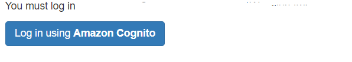

When the user clicks the log in button, they are presented with a login form where they can enter their user credentials.

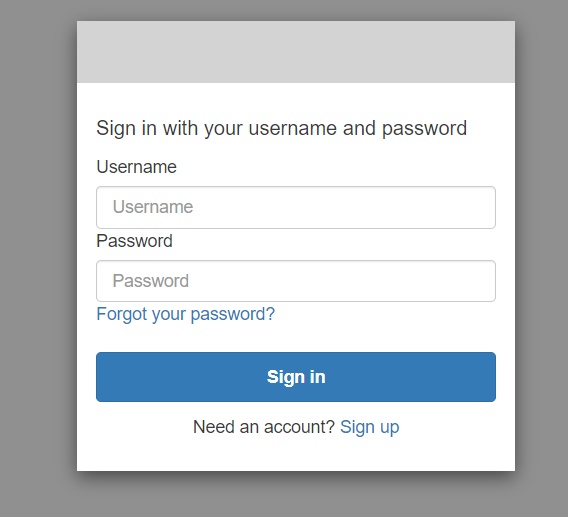

After the user enters their credentials, they can access the secured web application. 

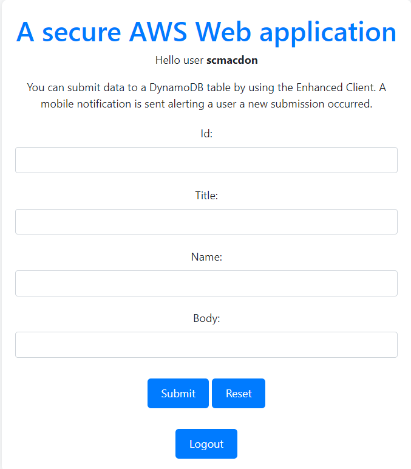

**Topics**

+ Prerequisites
+ Update the POM file
+ Create an Amazon Cognito User Pool
+ Define a client application within the User Pool
+ Configure the client application
+ Configure a domain name
+ Create a user
+ Modify your web application

## Prerequisites

To complete the tutorial, you need the following:

+ An AWS account
+ A Java IDE (this tutorial uses the IntelliJ IDE)
+ Java JDK 17
+ Maven 3.6 or later+ 

### Important

+ The AWS services included in this document are included in the [AWS Free Tier](https://aws.amazon.com/free/?all-free-tier.sort-by=item.additionalFields.SortRank&all-free-tier.sort-order=asc).
+  This code has not been tested in all AWS Regions. Some AWS services are available only in specific regions. For more information, see [AWS Regional Services](https://aws.amazon.com/about-aws/global-infrastructure/regional-product-services). 
+ Running this code might result in charges to your AWS account. 
+ Be sure to terminate all of the resources you create while going through this tutorial to ensure that you’re not charged.

### Creating the resources

Complete the **Creating your first AWS Java web application** tutorial. For information, see [Creating your first AWS Java web application](https://github.com/awsdocs/aws-doc-sdk-examples/tree/master/javav2/usecases/creating_first_project).

## Update the POM file

Make sure that your project's pom.xml file looks like the POM file in this Github repository. Make sure to use Spring BOOT version 2.6.0. 

## Create an Amazon Cognito user pool and app client

Create a User Pool in the AWS Management Console named **spring-example**. Once the User Pool is successfully created, you see a confirmation message.

1. Open the Amazon Cognito console at https://console.aws.amazon.com/cognito/home.

2. Choose **User Pools** from the left navigation pane. 

3. Choose the **Create user pool** button and provide your preferred settings.
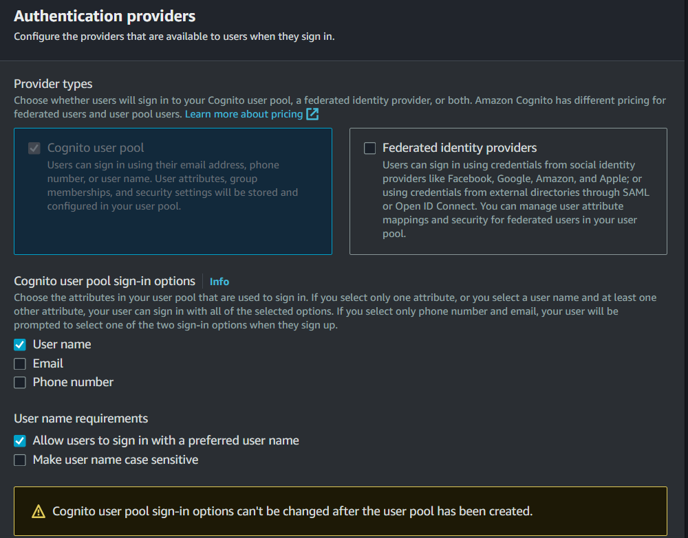
 
4. Keep the default settings expect for MFA. In the **Multi-factor authentication** section, select **No MFA**. 

5. In the **User pool name** field, enter **spring-example**.
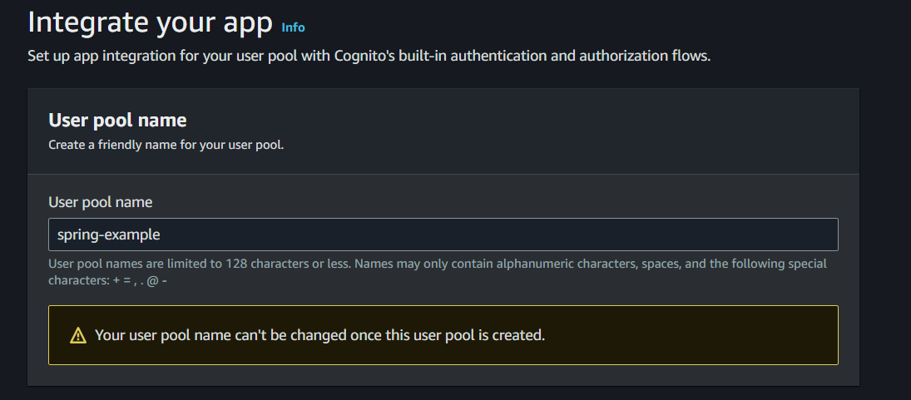 

6. In the **Initial app client** field, enter **spring-boot** and select **Generate a client secret**.

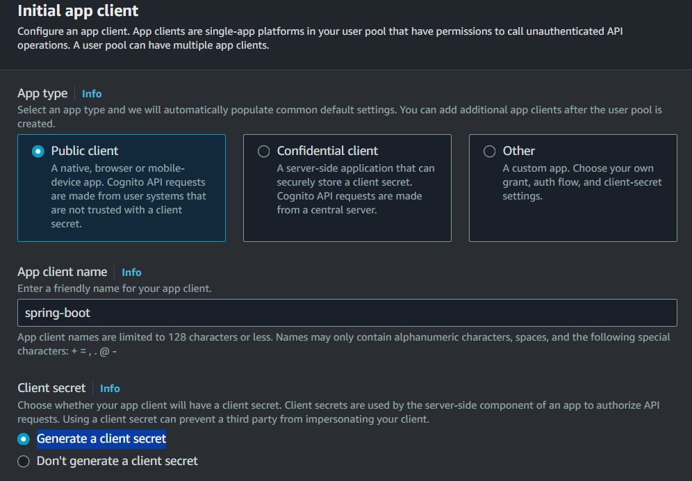

7. Choose **Next**, review your choices, then choose **Create user pool**. 

## Configure the app client

You must configure the app client. For example, you need to define OAuth scope values, such as **OpenID**, as shown in this illustration.

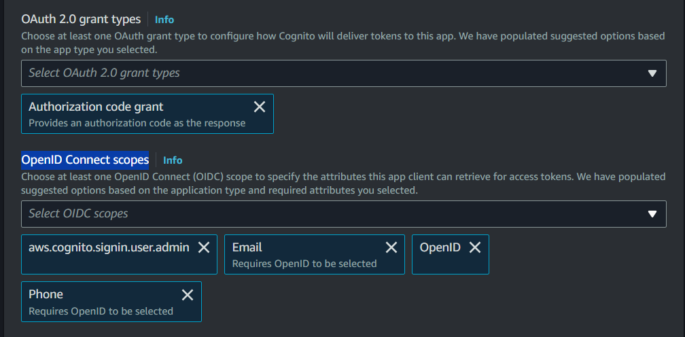

1. Choose your **spring-example** user pool from the **User pools** page. 

2. Choose the **App integration** tab.

3. Choose your **spring-boot** app client under **App clients and analytics**.

4. Under **Hosted UI**, choose **Edit**.

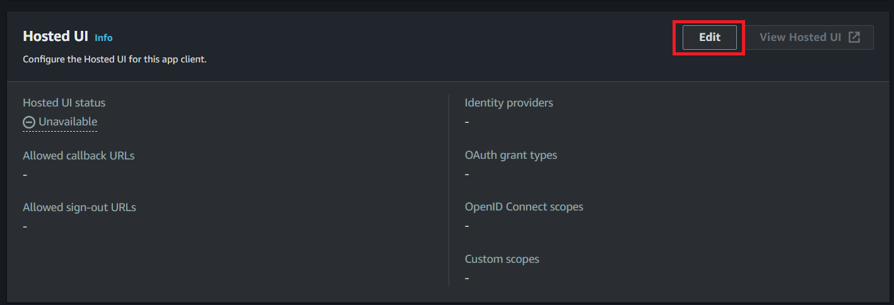

5. Add an **Allowed callback URL**. For example, with Spring Security, you can define the path as *http://localhost:8080/login/oauth2/code/cognito*. For local development, the localhost URL is all that is required. 

**Note**: For production applications, you can choose **Add another URL** to enter additional production callback URLs.

6. For the **Allowed sign-out URLs**, add *http://localhost:8080/logout*. 

7. Add **Authorization code grant** under **OAuth 2.0 grant types**.
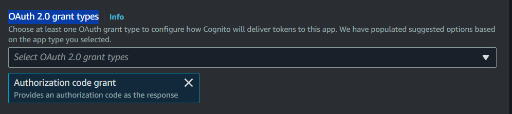 

8. Add **email** and **openid** under **OpenID Connect scopes**.
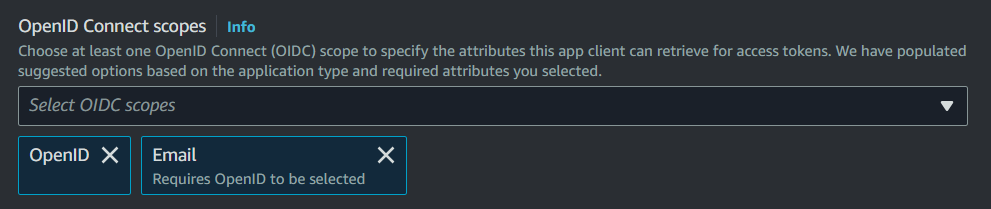
 
9. Choose **Save Changes**. 

Once done, you need to reference these two values. You need to specify these values in the YAML file (discussed later).
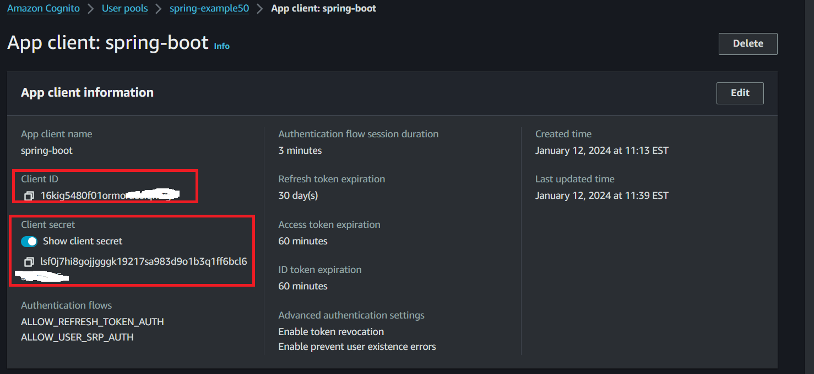

## Configure a domain name

In order for a Spring Boot application to use the log in form that is provided by Amazon Cognito, define a domain name in the AWS Management Console. 

1. Choose your **spring-example** user pool from the **User pools** page. 

2. Choose the **App integration** tab. 

3. Next to **Domain**, choose **Actions**, then **Create Cognito domain**.

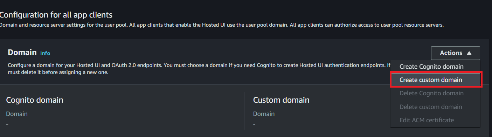

4. Enter a domain name.

5. Choose **Save Changes**. 

## Create a user

Create a user that you can use to log into the application. In this example, the user has a user name and a password. 

1. Choose the **Users** tab. 

2. Choose **Create User**.

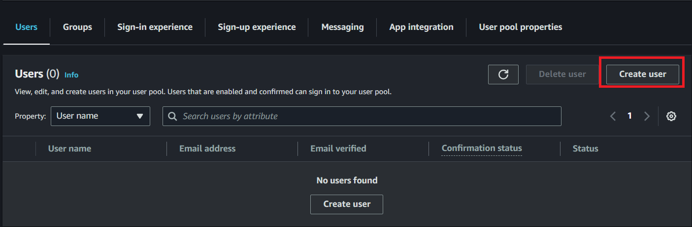

3. In the **Create user** dialog, enter the user name and any additional information you want to provide. Choose **Mark email address as verified**. 

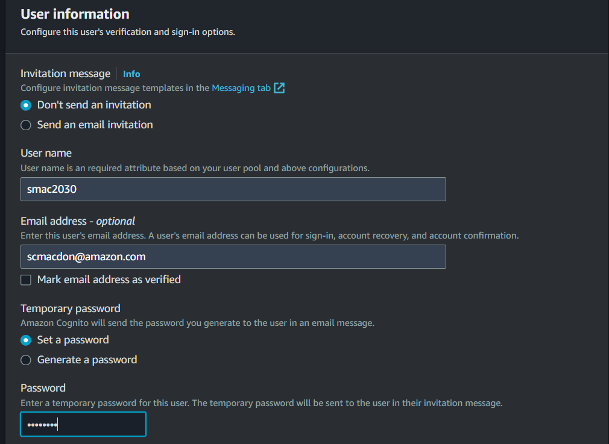

4. Choose **Create user**.

5. Set the user's password permanently with the following CLI command:
aws cognito-idp admin-set-user-password --user-pool-id us-east-1_EXAMPLE --username UserFoo --password abc123EXAMPLEpassword! --permanent

6. Review the **Users** tab. Ensure that your new user is verified and confirmed.

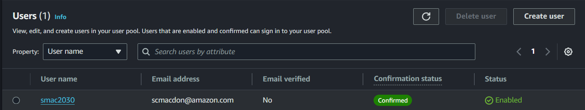

At this point, you need the following values to proceed: client id, client secret, pool id value, and the AWS region you are using. Without all of these values, you cannot use Amazon Cognito to require a user to log into your web application. 
           
### Next steps
Congratulations, you have required a user to log into a web application by using Amazon Cognito. As stated at the beginning of this tutorial, be sure to delete all of the resources you created while going through this tutorial to ensure that you’re not charged.

For more AWS multiservice examples, see
[usecases](https://github.com/awsdocs/aws-doc-sdk-examples/tree/master/javav2/usecases).

